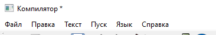
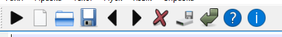
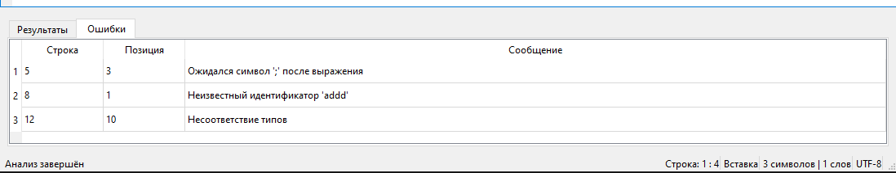
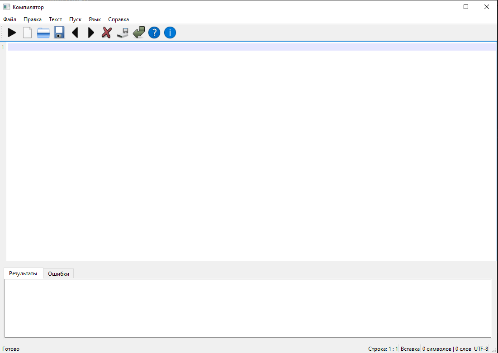
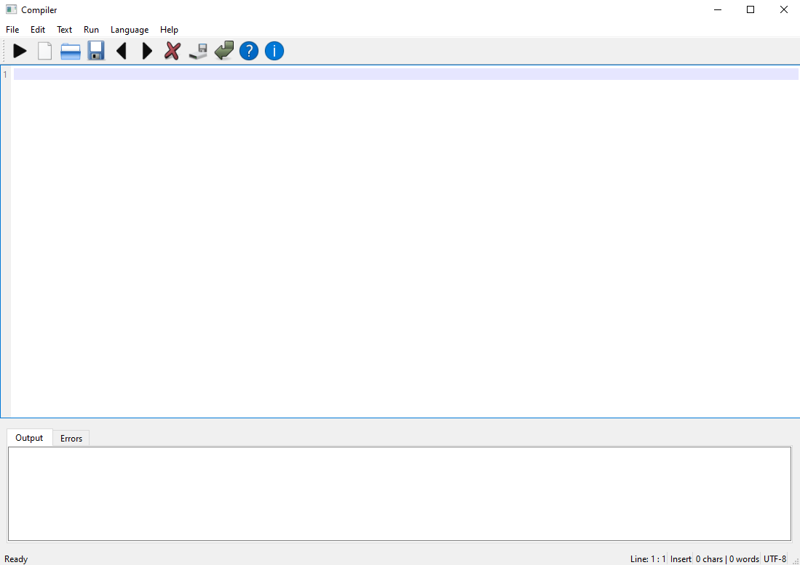
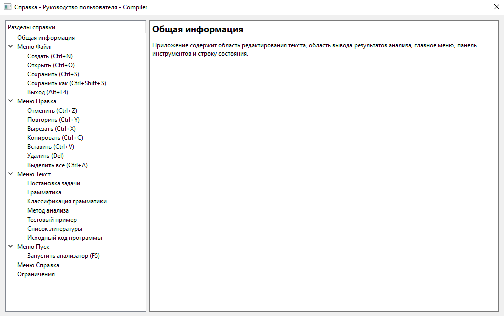
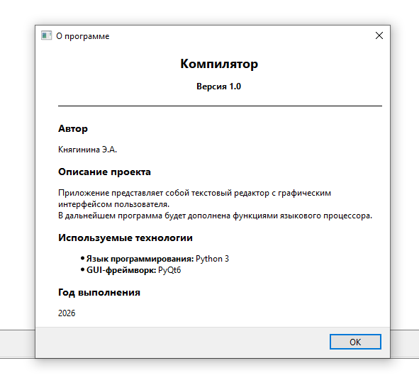

# Разработка пользовательского интерфейса (GUI) для языкового процессора

**Тема:** Разработка приложения - текстовый редактор с графическим интерфейсом пользователя (GUI).  
В дальнейшем приложение будет дополнено функциями языкового процессора (лексический и синтаксический анализатор).  

**Язык реализации:** Python + PyQt6  
**Год:** 2026

## Цель работы

Разработать приложение — текстовый редактор с графическим интерфейсом пользователя.

Приложение должно содержать:
- основное меню программы
- панель инструментов
- окно/область ввода и редактирования текста
- окно/область отображения результатов работы языкового процессора (ввод текста в этой области запрещён)

## Основное меню (1)

- **Файл** — Создать, Открыть, Сохранить, Сохранить как, Выход  
- **Правка** — Отменить, Повторить, Вырезать, Копировать, Вставить, Удалить, Выделить все  
- **Текст** — Постановка задачи, Грамматика, Классификация грамматики, Метод анализа, Тестовый пример, Список литературы, Исходный код программы  
- **Пуск** — Запуск анализатора  
- **Справка** — Вызов справки, О программе  
- **Язык** — Русский / English (дополнительная функция локализации)



## Панель инструментов (2)

Панель инструментов содержит кнопки вызова часто используемых пунктов меню:

1. Создание документа  
2. Открытие документа  
3. Сохранение текущих изменений в документе  
4. Отмена изменений  
5. Повтор последнего изменения  
6. Копировать текстовый фрагмент  
7. Вырезать текстовый фрагмент  
8. Вставить текстовый фрагмент  
9. Запуск синтаксического анализатора  
10. Вызов справки — руководства пользователя  
11. Вызов информации о программе  



## Реализованные элементы интерфейса

- Область редактирования текста (3) с нумерацией строк
- Область результатов (4) с двумя вкладками:  
  • **Результаты** — текстовый вывод сообщений и результатов анализа  
  • **Ошибки** — таблица с колонками «Строка», «Позиция», «Сообщение»  



## Дополнительные возможности

- Локализация интерфейса (русский / английский)  
- Статусная строка: позиция курсора, режим ввода (Вставка/Замена), количество символов и слов, кодировка  
- Подтверждение сохранения при закрытии изменённого файла  
- Разделитель для изменения размеров областей  
- Автоматическая адаптация интерфейса при изменении размера окна  

## Скриншоты приложения

### Главное окно (русский язык)


### Главное окно (английский язык)


### Меню "Справка"


### Диалог «О программе»


## Установка и запуск

### Требования
- Python 3.8+
- PyQt6

```bash
pip install PyQt6