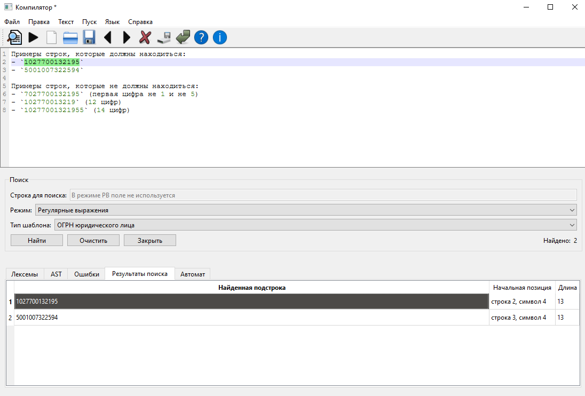
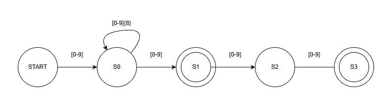
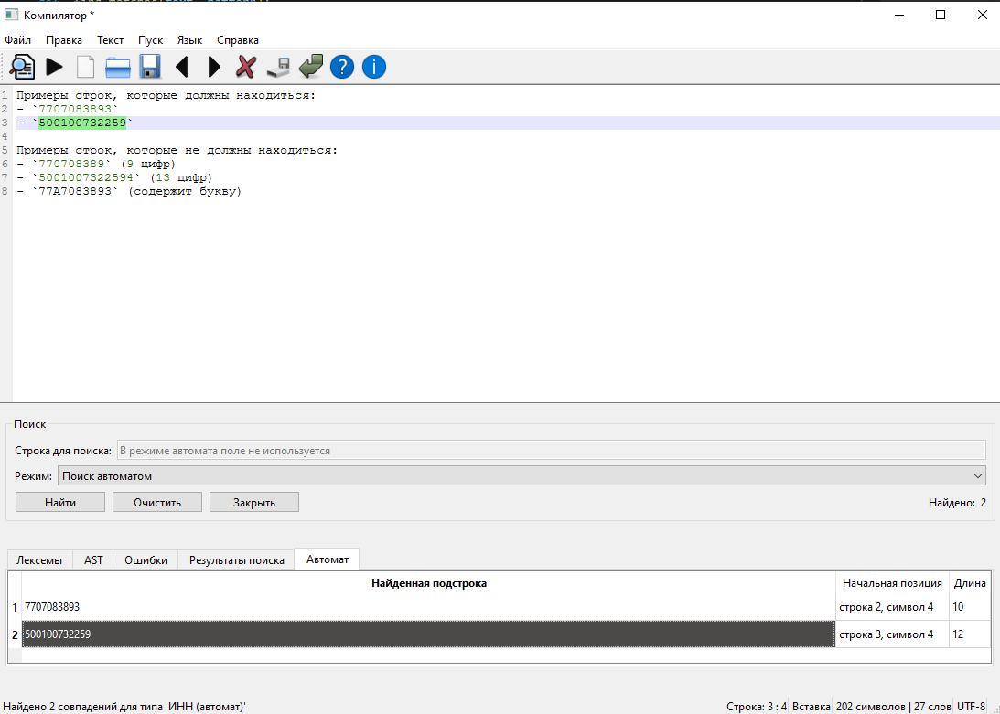

## Лабораторная работа №4

###  Цель работы 
Изучить теоретические основы регулярных выражений и их применение для поиска и извлечения подстрок из текста. Освоить практические навыки использования библиотечных средств работы с регулярными выражениями, а также интеграцию алгоритмов поиска в графический интерфейс приложения.

### Постановка задачи

Разработать модуль поиска подстрок с использованием регулярных выражений, интегрировать его в существующее приложение (текстовый редактор) и обеспечить наглядный вывод результатов.

## Решение задач 

### Задача 1. Поиск ОГРН юридического лица

**Регулярное выражение:**  
`\\b[15]\\d{2}\\d{2}\\d{7}\\d\\b`

**Примеры строк, которые должны находиться:**
- `1027700132195`
- `5001007322594`

**Примеры строк, которые не должны находиться:**
- `7027700132195` (первая цифра не 1 и не 5)
- `102770013219` (12 цифр)
- `10277001321955` (14 цифр)

### Задача 2. Поиск ИНН

**Описание задачи:**  
Найти в тексте ИНН длиной 10 или 12 цифр.

**Регулярное выражение:**  
`\\b(?:\\d{10}|\\d{12})\\b`

**Примеры строк, которые должны находиться:**
- `7707083893`
- `500100732259`

**Примеры строк, которые не должны находиться:**
- `770708389` (9 цифр)
- `5001007322594` (13 цифр)
- `77A7083893` (содержит букву)

### Задача 3. Поиск чисел (целые, вещественные, экспоненциальные)

**Описание задачи:**  
Найти числовые литералы со знаком или без, с дробной частью и/или экспонентой.

**Регулярное выражение:**  
`(?<![\\w.])[-+]?(\\d+)([.,]\\d+)?([eE][-+]?\\d+)?(?!\\w)`

**Примеры строк, которые должны находиться:**
- `123`
- `-45`
- `3.14`
- `2,718`
- `6.02e23`
- `-1E-3`

**Примеры строк, которые не должны находиться:**
- `12..3`
- `1e`
- `+`

### Тестовые примеры



### Граф автомата



### Запуск программы

```bash
pip install PyQt6
cd app
python compiler.py
```
