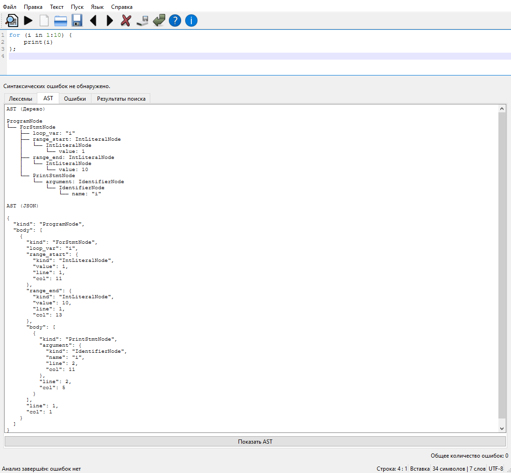
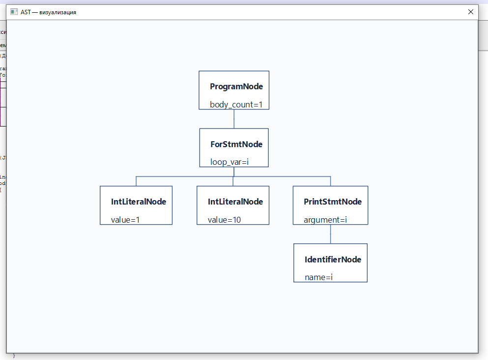
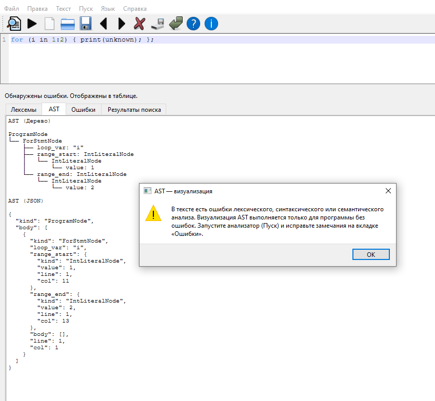

## Лабораторная работа №5 - абстрактное синтаксическое дерево и семантический анализ

### Вариант задания

**Вариант:** цикл for на языке R; построение **AST**.

Корректный пример:

```text
for (i in 1:10) {
    print(i)
};
```

### Цель работы

Изучить назначение семантического анализатора в структуре компилятора, освоить построение AST для заданной грамматики и реализовать проверку контекстно-зависимых условий (уникальность имён, типы, диапазоны, использование объявленных идентификаторов в `print`).

### Контекстно-зависимые условия (правила 1–4)

| № | Проверка | Пример входа | Ожидаемое сообщение (RU, смысл) |
|---|----------|----------------|----------------------------------|
| 1 | Уникальность имён в области | `const x = 1; const x = 2;` | Идентификатор «x» уже объявлен ранее (строка …) |
| 2 | Совместимость типа и литерала | `const y: int = 2.5;` | Несоответствие типов: для «int» литерал имеет тип «float» |
| 3 | Допустимые целые значения и порядок границ `for` | `for (i in 10:1) { print(i); };` | Выход за [0, 2³¹−1] / неверный порядок границ диапазона |
| 4 | Аргумент `print` объявлен | `for (i in 1:2) { print(unknown); };` | Идентификатор «unknown» использован без объявления |


### Что реализовано в программе

- Синтаксический разбор и построение AST (`app/syntax_parser.py`, узлы в `app/ast_nodes.py`).
- Семантические проверки (правила 1–4) в процессе разбора.
- Вывод AST на вкладке **AST**: текстовое дерево и JSON.
- Вывод ошибок на вкладке **Ошибки**: *Неверный фрагмент* | *Местоположение* | *Описание*; подсветка фрагмента в редакторе по щелчку.
- Строка **«Общее количество ошибок: N»** под таблицей ошибок.
- Графическое окно **«Показать AST»** (кнопка внизу вкладки **AST**).

### Структура AST

Используются узлы:

- `ProgramNode` — корень, список операторов верхнего уровня.
- `ConstDeclNode`, `VarDeclNode` — объявления с именем, модификаторами, типом и литералом-значением.
- `ForStmtNode` — цикл `for`, переменная и диапазон; дочерние узлы — границы (`IntLiteralNode`) и тело.
- `PrintStmtNode` — вызов `print`, дочерний `IdentifierNode`.
- `IntLiteralNode`, `FloatLiteralNode` — литералы.
- `IdentifierNode` — использование имени.
- `SimpleTypeNode` — явный тип `int` / `float` при аннотации.


**Пример AST** для `for (i in 1:10) { print(i); };`:

```text
ProgramNode
`- ForStmtNode (loop_var=i)
   |- IntLiteralNode (value=1)
   |- IntLiteralNode (value=10)
   `- PrintStmtNode (argument=i)
      `- IdentifierNode (name=i)
```


### Формат вывода программы

**Вкладка `AST`:**

- печатается текстовое дерево AST (блок «AST (Дерево)»);
- JSON-представление;
- внизу вкладки - кнопка **`Показать AST`** (графическое дерево в отдельном окне, если ошибок нет).

**Вкладка `Ошибки`:**

- таблица: *Неверный фрагмент* | *Местоположение* | *Описание*;
- внизу: **Общее количество ошибок: N**.

### Графическая визуализация AST

Отдельное окно открывается по кнопке **`Показать AST`** на вкладке **`AST`**. Кнопка **«Показать AST»** сама выполняет лексический и синтаксический/семантический разбор текста; окно графа открывается только если **ошибок нет**.

Использованные графические средства:

- `PyQt6.QtWidgets.QGraphicsView` + `QGraphicsScene` - холст;
- `QGraphicsRectItem` - прямоугольники узлов;
- `QGraphicsTextItem` - подписи (тип узла и атрибуты в формате `key=value`);
- `QGraphicsLineItem` - рёбра «родитель -> потомок».


### Тестовые примеры

#### Тестовые примеры с нарисованным AST

1.
   Скриншот: 
  
корректная программа и вкладка **AST** / граф.

2.
   Скриншот: 
  
пример с ошибкой.

### Инструкция по запуску

## Установка, запуск и сборка

### Требования

- Python 3.8+  
- PyQt6  

### Запуск из исходников

```bash
pip install PyQt6
cd app
python compiler.py
```

### Сборка исполняемого файла 

```bash
cd app
pyinstaller compiler.spec
```

