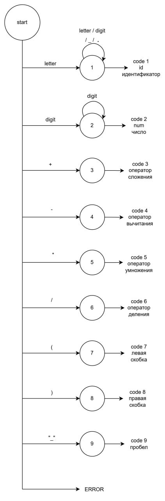
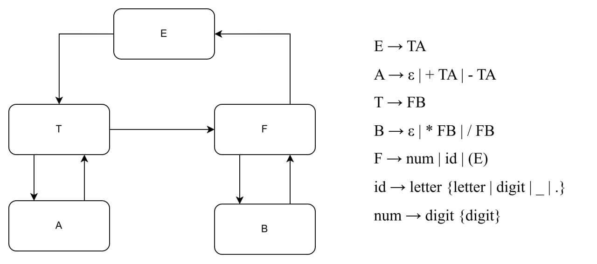
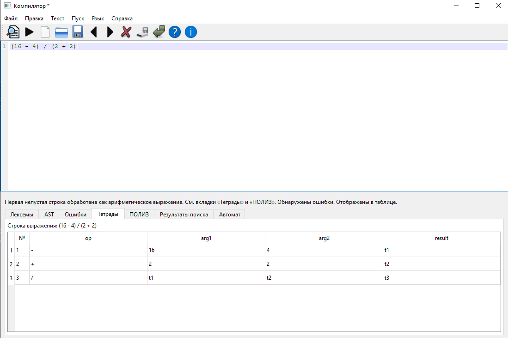
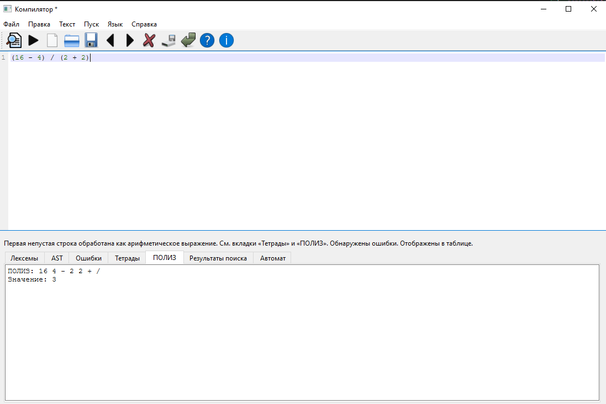
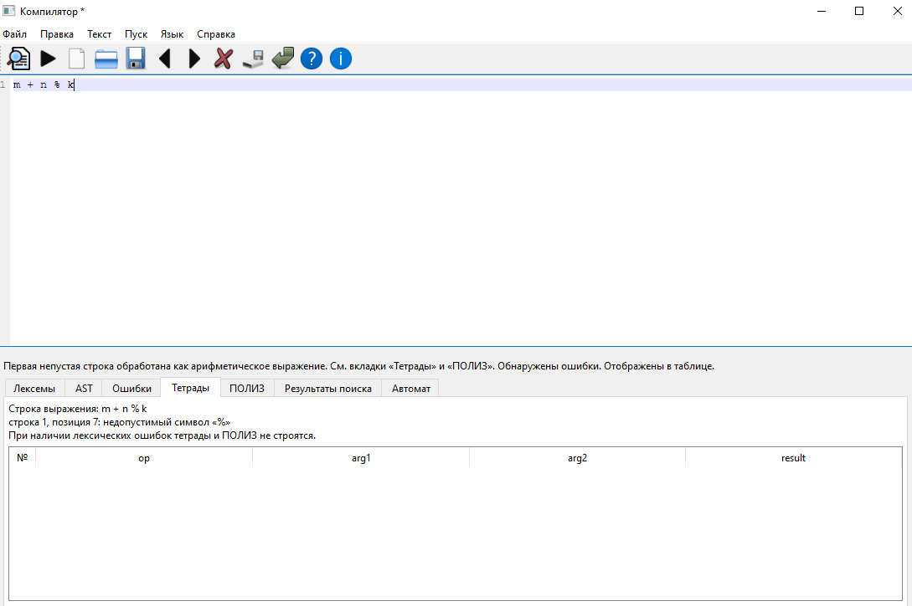
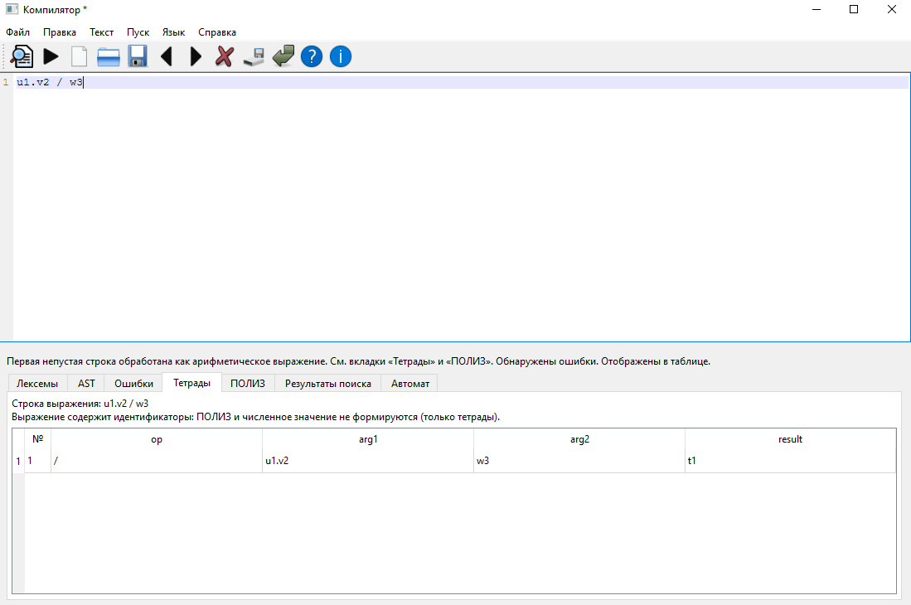

# Лабораторная работа 6. Создание внутренней формы представления программы

## Название работы и ФИО автора

- **Работа:** Создание внутренней формы представления программы (тетрады, ПОЛИЗ, рекурсивный спуск).
- **Автор:** Княгинина Элеонора АВТ-314

## Цель работы

Изучить методы построения внутреннего представления программы (ВПП) на основе контекстно-свободной грамматики, реализовать синтаксический анализатор методом рекурсивного спуска и преобразовать арифметические выражения в тетрады и ПОЛИЗ.

## Вариант задания

- **Вариант:** 14 (R).
- **Язык:** арифметические выражения (лексика уровня лексем: числа, идентификаторы, операции `+ - * /`, скобки).

### Полное определение КС-грамматики

```
E → TA
A → ε | + TA | - TA
T → FB
B → ε | * FB | / FB
F → num | id | (E)
id → letter {letter | digit | _ | .}
num → digit {digit}

```

### Примеры корректных строк

- `a + b * c`
- `(x + 12) / y - z`
- `2 + 3 * (4 - 1)`
- `100 / (5 + 5) + 7`
- `obj.field + 1` (идентификатор с точкой внутри по правилу `id`)

## Лексические и синтаксические ошибки

Алфавит **выражения** (вариант 14): операторы `+ - * /`, скобки `( )`, пробелы, **числа** `num`, **идентификаторы** `id` (начинаются с буквы; далее буква, цифра, `_`, `.`). Всё остальное в строке выражения — лексическая ошибка или приводит к синтаксической после разбора.

### Тестовые примеры 

#### 1) Корректная строка (тетрады + ПОЛИЗ)

**Вход:**

```
(16 - 4) / (2 + 2)
```

**Ожидается:**

- успешный лексический и синтаксический анализ выражения;
- таблица тетрад: `(-, 16, 4, t1)`, `(+, 2, 2, t2)`, `(/, t1, t2, t3)`;
- ПОЛИЗ: `16 4 - 2 2 + /`;
- вычисленное значение: **3**.

#### 2) Лексическая ошибка

**Вход:**

```
m + n % k
```

**Ожидается:**

- сообщение о недопустимом символе **`%`** (в варианте 14 оператор `%` не входит в грамматику);
- предупреждение: тетрады и ПОЛИЗ **не** строятся.


#### 3) Синтаксическая ошибка: пропущенный операнд

**Вход:**

```
10 / * 5
```

**Ожидается:**

- сообщение о **пропущенном операнде** (после `/` ожидался множитель `F`, а встретился `*`);
- тетрады и ПОЛИЗ не строятся.


#### 4) Синтаксическая ошибка: лишняя скобка / несбалансированность

**Вход (лишняя `)` в конце):**

```
(1 + 2) * (3 - 4))
```

**Ожидается:**

- сообщение о **лишней закрывающей скобке** или лишнем фрагменте;
- тетрады и ПОЛИЗ не строятся.

**Вход (не хватает `)`):**

```
(8 - 1
```

**Ожидается:**

- сообщение о **пропущенной закрывающей скобке** `)`;
- тетрады и ПОЛИЗ не строятся.

### Диагностируемые ошибки

| Ошибка | Пример | Описание |
|--------|--------|----------|
| Недопустимый символ | `%`, `$`, `#`, `;` | Символ **не входит в алфавит** выражения (`+ - * / ( )`, буквы, цифры, `_`, `.`, пробел). **Лексическая** ошибка. |
| «Имя» с цифры | `123ab`, `45_x` | После числа идёт продолжение как у `id` — **лексическая** ошибка: идентификатор не может начинаться с цифры. |
| Пропущен операнд | `10 / * 5`, `() + 8`, `* 3`, `+ 1` | В позиции множителя `F` ожидались `num`, `id` или `(`, а встретился оператор, `)` или конец строки. **Синтаксическая** ошибка. |
| Несбалансированные скобки | `(8 - 1` | Открыта `(`, до конца выражения **нет** парной `)`. **Синтаксическая** ошибка (пропущена `)`). |
| Лишняя `)` / лишний хвост | `(1 + 2) * (3 - 4))`, `1 + 2 3` | Закрывающая скобка **без** соответствующей открывающей или **лишние символы** после корректного выражения. **Синтаксическая** ошибка. |


### Диаграмма лексера 



### Схема рекурсивного спуска для парсера



### Скриншоты работы программы










## Внутренняя форма представления программы (тетрады)

Тетрады вида `(op, arg1, arg2, result)` строятся **только** при отсутствии лексических и синтаксических ошибок. 

## ПОЛИЗ

ПОЛИЗ строится алгоритмом Дейкстры (сортировочная станция). Приоритет: `*` и `/` выше, чем `+` и `-`; операции левоассоциативны.

ПОЛИЗ и вычисление значения выполняются **только** для выражений, в которых нет идентификаторов (только целые литералы `num` и операции со скобками).

## Реализация в проекте

- Основной модуль: `app/lab6_expression_analyzer.py` (лексика, рекурсивный спуск, тетрады, ПОЛИЗ, вычисление для целых).
- Запуск из корня репозитория:

```bash
python main.py
```


