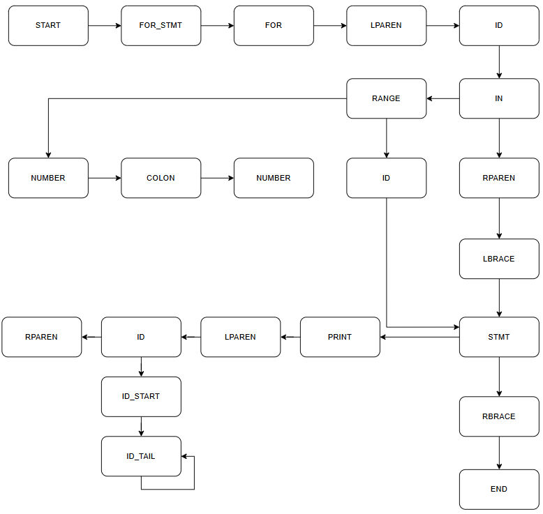
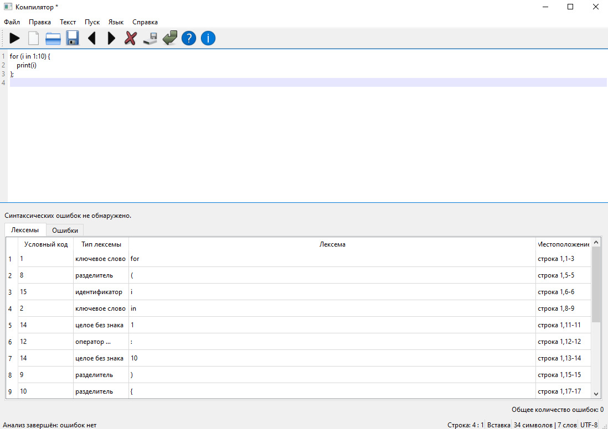
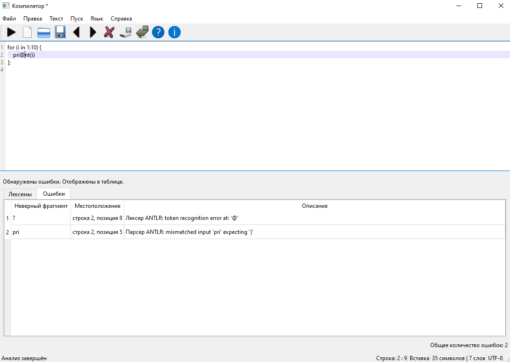
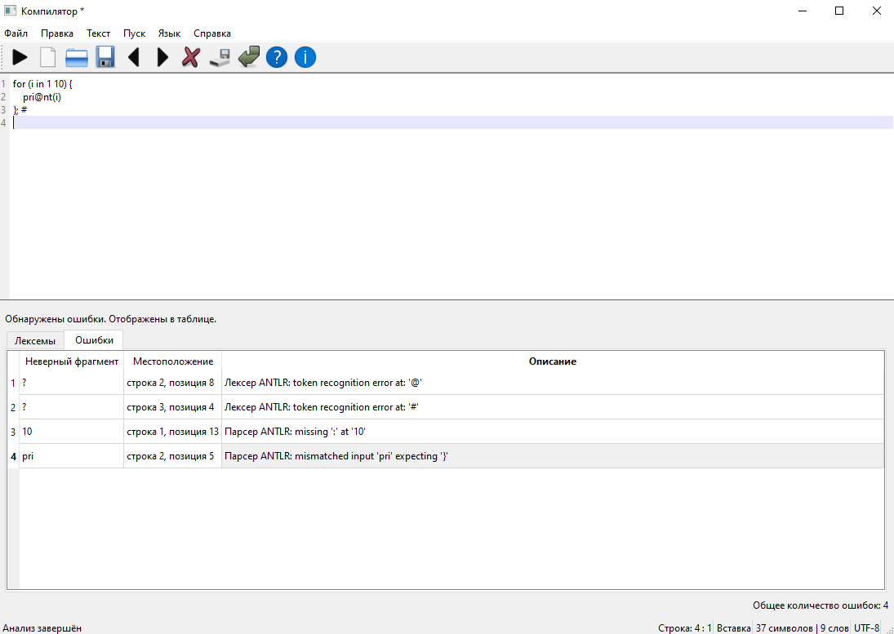

# Лабораторная работа №3  
**Тема:** Разработка синтаксического анализатора (парсера).

**Цель работы:** Изучить назначение и принципы работы синтаксического анализатора в структуре компилятора. Спроектировать грамматику, построить соответствующую схему метода анализа грамматики и выполнить программную реализацию парсера с нейтрализацией синтаксических ошибок методом Айронса. Интегрировать разработанный модуль в ранее созданный графический интерфейс языкового процессора.

## 1. Вариант задания **Цикл for на языке R**

**Вариант 110:**

```text
for (i in 1:10) {
    print(i)
};
```

**Другие корректные примеры входной строки:**

```text
for (k in 0:2) {
    print(k)
};
```

```text
for (i in n) {
    print(i)
};
```

**Допустимые лексемы**:

| Лексема | Примеры / вид |
|--------|----------------|
| Ключевые слова | `for`, `in`, `print` |
| Идентификатор | `<ID>` / `<LETTER>` |
| Число | `<NUMBER>` |
| Символ диапазона | `:` |
| Разделители | `(`, `)`, `{`, `}`, `;` |
| Пробельные символы | пробел, табуляция, перевод строки |

Недопустимые в исходном тексте символы (кроме перечисленных конструкций) фиксируются как лексические ошибки.

## 2. Разработка грамматики (полное определение)

Вспомогательные нетерминалы `<LETTER>` и `<DIGIT>` добавлены для однозначного определения `<ID>` и `<NUMBER>`.

```text
<Z>      -> "for" " " "(" <ID> "in" <RANGE> ")" "{" <STMT> "}" ";"

<RANGE>  -> <NUMBER> ":" <NUMBER>
         |  <ID>

<STMT>   -> "print" "(" <ID> ")"

<ID>     -> <LETTER>
         |  <LETTER> <ID>
         |  <NUMBER> <ID>
         |  "_" <ID>

<NUMBER> -> <DIGIT>
         |  <DIGIT> <NUMBER>

<LETTER> -> "a" | "b" | … | "z" | "A" | "B" | … | "Z"

<DIGIT>  -> "0" | "1" | … | "9"

Множество нетерминалов:  
`VN = { <Z>, <RANGE>, <STMT>, <ID>, <NUMBER>, <LETTER>, <DIGIT> }`

Множество терминалов:  
`VT = { "for", "in", "print", " ", "(", ")", "{", "}", ";", ":", "_", "a".."z", "A".."Z", "0".."9" }`

```


**Разработанная грамматика для ПО ANTLR**

```text
grammar MiniR;

program
    : statement* EOF
    ;

statement
    : constDecl
    | varDecl
    | forStmt
    ;

constDecl
    : CONST ID ASSIGN literal SEMI
    ;

varDecl
    : VAR ID ASSIGN literal SEMI
    ;

forStmt
    : FOR LPAREN ID IN intRange RPAREN LBRACE blockBody RBRACE SEMI
    ;

intRange
    : INT COLON INT
    ;

blockBody
    : blockStmt*
    ;

blockStmt
    : printStmt
    | forStmtNested
    ;

forStmtNested
    : FOR LPAREN ID IN intRange RPAREN LBRACE blockBody RBRACE SEMI?
    ;

printStmt
    : PRINT LPAREN ID RPAREN SEMI?
    ;

literal
    : INT
    | FLOAT
    ;

// ——— Лексер: ключевые слова раньше ID ———
FOR   : 'for';
IN    : 'in';
PRINT : 'print';
CONST : 'const';
VAR   : 'var';

ASSIGN : '=';
SEMI   : ';';
LPAREN : '(';
RPAREN : ')';
LBRACE : '{';
RBRACE : '}';
COLON  : ':';

// Вещественное до целого (иначе 1.0 разберётся как INT + ошибка)
FLOAT
    : [0-9]+ '.' [0-9]*
    | '.' [0-9]+
    ;

INT : [0-9]+;

ID : [_a-zA-Z] [_a-zA-Z0-9]*;

WS : [ \t\r\n]+ -> skip;

LINE_COMMENT : '//' ~[\r\n]* -> skip;
```

## 3. Классификация грамматики (по Хомскому)

Грамматика относится к **контекстно-свободной грамматике**:

- правила имеют вид \(A \to \alpha\), где \(A\) - один нетерминал;
- в правых частях есть рекурсия в `<ID>` и `<NUMBER>`, а также ветвление у `<RANGE>`;
- контекстно-зависимые правила для описания синтаксиса не требуются.

## 4. Метод анализа

Реализован **рекурсивный спуск** (класс `SyntaxParser` в `app/syntax_parser.py`):

- для каждого нетерминала (или семейства правил) есть процедура разбора;
- текущая позиция в потоке токенов сдвигается при успешном «съедании» ожидаемого токена;
- альтернативы выбираются по виду текущего токена (`kind`: `KW_CONST`, `KW_VAR`, `KW_FOR`, …).

Лексический анализ - сканирование слева направо с разбиением на токены (`app/lexical_analyzer.py`).

**Граф рекурсивного спуска:**



## 5. Диагностика и нейтрализация синтаксических ошибок

**Метод нейтрализации ошибок: метод Айронса**

После обнаружения синтаксической ошибки анализатор не завершает работу, а переходит в режим восстановления - пропускает часть входных токенов до ближайшего «синхронизирующего» символа, после чего продолжает разбор с устойчивой позиции. Это позволяет:

- локализовать ошибку в месте возникновения;
- избежать зацикливания парсера;
- уменьшить каскад вторичных сообщений;
- получить несколько диагностик за один запуск.

Обработка ошибок в приложении:

1. **Фиксация ошибки**  
   При несовпадении ожидаемого и фактического токена вызываются `_expect_failed` / `_expect_or_report`; в список ошибок заносятся строка, позиция, тип и фрагмент.

2. **Локальный сдвиг (защита от повторной ошибки)**  
   После регистрации ошибки используется `_skip_error_token`, чтобы не обрабатывать тот же проблемный токен повторно.

3. **Синхронизация по контрольным точкам**  
   Анализатор пропускает токены до ближайшей границы конструкции:
   - верхний уровень программы: `_synchronize_irons` -> до `;`, `KW_CONST`, `KW_VAR`, `KW_FOR`, `EOF`;
   - тело блока: `_synchronize_in_block` -> до `}`, `;`, `KW_FOR`, `KW_PRINT`, `ID`, `EOF`;
   - заголовок цикла: `_synchronize_for_header` -> до `{`, `;`, `}`, `EOF`, `KW_CONST`, `KW_VAR`, `KW_FOR`.

4. **Возврат к нормальному разбору**  
   После достижения точки синхронизации парсер продолжает работу по обычным правилам рекурсивного спуска.

## 6. Тестовые примеры (Реализация с помощью ANTLR)

Без ошибок:



С 1 ошибкой:



С 3 ошибками (отобразило 4 ошибки):



